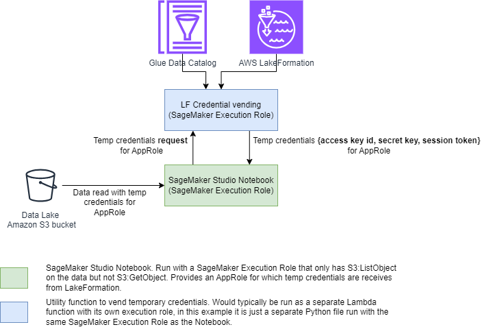
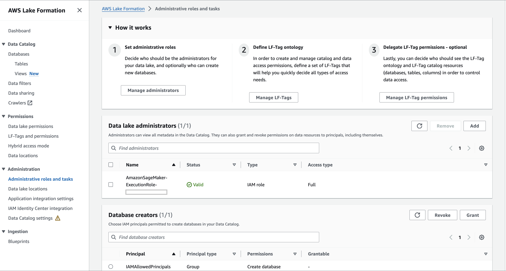
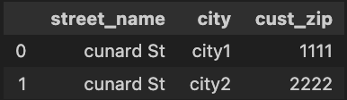

# Amazon SageMaker & AWS LakeFormation Integration - Vend Temporary Credentials to read data from S3 in a `Pandas` and `Spark` dataframe

This example demonstrates how to read data from Amazon S3 using temporary credentials vended by LakeFormation without the execution role being used having any direct access to S3. The vended credentials are used to read data from S3 into a Pandas dataframe and a Spark dataframe.

## Solution overview

This solution contains a utility function that invokes LakeFormation APIs to grant permissions and vend temporary credentials for a table registered with the Glue Data Catalog. This utility function is invoked from a SageMaker Studio Notebook to get the temporary credentials and then use these credentials to read data from S3. Note that the temporary credentials are retrieved from a different application specific role that represents the application that wants to read the data. The application in this example is the SageMaker Studio Notebook and it is asking LakeFormation (through the credential vending utility function) to provide it the credentials so that it can read the data. **_It is important to note that the application itself has NO access to read the data from S3 and depends upon the temporary vended credentials to read the data; thus enforcing the coarse grained access conrol through LakeFormation_**.



## Prerequisites

This solution requires that you have SageMaker Studio setup in your account and have the necessary IAM permissions to setup policies for LakeFormation and S3 access as described in the next section.

## Setup

This solution requires LakeFormation, Glue and IAM role setup. Each of these is described in the sections below.

### IAM role setup

There are two IAM roles involved in this solution, a `SageMaker Execution Role` and an `Application Role`. The `SageMaker Execution Role` is used to run the notebook and it is also the one that has the required access to vend temporary credentials to the `Application Role`. The `Application Role` as the name suggests is a role tied to the application (in this case the SageMaker Notebook) which in itself has no access to read data from S3 but can be assigned temporary credentials by the `SageMaker Execution Role` to enable it to temporarily read data from S3.

#### `SageMaker Execution Role` Permissions

1. Create an inline policy with LakeFormation Permissions as shown below and assign it to the `SageMaker Execution Role`.

    ```{.json}
    {
        "Version": "2012-10-17",
        "Statement": {
            "Effect": "Allow",
            "Action": [
                "lakeformation:GetDataAccess",
                "lakeformation:GetDataLakeSettings",
                "lakeformation:GrantPermissions",
                "glue:GetTable",
                "glue:CreateTable",
                "glue:GetTables",
                "glue:GetDatabase",
                "glue:GetDatabases",
                "glue:CreateDatabase",
                "glue:GetUserDefinedFunction",
                "glue:GetUserDefinedFunctions",
                "glue:GetPartition",
                "glue:GetPartitions"
            ],
            "Resource": "*"
        }
    }
    ```

1. Add `AmazonSageMakerFullAccess` permission (this might already be there).

1. Add an inline policy to allow `sts:AssumeRole` and `sts:TagSession` on the role `Application Role` that gets fine-grained access control over the table in the Glue data catalog.

    ``` {.json}
    {
        "Version": "2012-10-17",
        "Statement": [
            {
                "Sid": "",
                "Effect": "Allow",
                "Action": [
                    "sts:AssumeRole",
                    "sts:TagSession"
                ],
                "Resource": [
                    "arn:aws:iam::<your-account-id>:role/<application-role>"
                ]
            }
        ]
    }
    ```

#### SageMaker Execution Role Trust Policies

```{.json}
{
    "Version": "2012-10-17",
    "Statement": [
        {
            "Effect": "Allow",
            "Principal": {
                "Service": "sagemaker.amazonaws.com"
            },
            "Action": "sts:AssumeRole"
        },
        {
            "Sid": "AllowAssumeRoleAndPassSessionTag",
            "Effect": "Allow",
            "Principal": {
                "AWS": "arn:aws:iam::<account-id>:root"
            },
            "Action": [
                "sts:AssumeRole",
                "sts:TagSession"
            ],
            "Condition": {
                "StringLike": {
                    "aws:RequestTag/LakeFormationAuthorizedCaller":"<your-session-value-tag>"
                }
            }
        },
        {
            "Effect": "Allow",
            "Principal": {
                "Service": "glue.amazonaws.com"
            },
            "Action": "sts:AssumeRole"
        },
        {
            "Sid": "AllowPassSessionTags",
            "Effect": "Allow",
            "Principal": {
                "AWS": "<application-role>"
            },
            "Action": "sts:TagSession",
            "Condition": {
                "StringLike": {
                    "aws:RequestTag/LakeFormationAuthorizedCaller": "<your-session-value-tag>"
                }
            }
        }
    ]
}

```

#### `SageMaker Execution Role` as Data Lake Admin

On the LakeFormation administration page make the `SageMaker Execution Role` a data lake admin as shown in the screenshot below.



#### `Application Role` Trust Policies (Role that gets `fine-grained` access control)

``` {.json}
{
    "Version": "2012-10-17",
    "Statement": [
        {
            "Sid": "AllowAssumeRoleAndPassSessionTag",
            "Effect": "Allow",
            "Principal": {
                "AWS": "arn:aws:iam::<account-id>:root"
            },
            "Action": [
                "sts:AssumeRole",
                "sts:TagSession"
            ]
        },
        {
            "Effect": "Allow",
            "Principal": {
                "Service": "lakeformation.amazonaws.com"
            },
            "Action": "sts:AssumeRole"
        },
        {
            "Sid": "AllowPassSessionTags",
            "Effect": "Allow",
            "Principal": {
                "AWS": "<lf-role-to-be-assumed>"
            },
            "Action": "sts:TagSession",
            "Condition": {
                "StringLike": {
                    "aws:RequestTag/LakeFormationAuthorizedCaller":"<your-session-value-tag>"
                }
            }
        }
    ]
}
```

#### `Application Role` Permissions

```{.json}
{
	"Version": "2012-10-17",
	"Statement": [
		{
			"Effect": "Allow",
			"Action": [
				"lakeformation:GetDataAccess",
				"glue:GetTable",
				"glue:GetTables",
				"glue:GetDatabase",
				"glue:GetDatabases",
				"glue:CreateDatabase",
				"glue:GetUserDefinedFunction",
				"glue:GetUserDefinedFunctions",
				"glue:GetPartition",
				"glue:GetPartitions"
			],
			"Resource": "*"
		}
	]
}
```

## S3 and Glue Data Crawler setup

The [`sagemaker-lf-credential-vending.ipynb`](sagemaker-lf-credential-vending.ipynb) notebook creates a Glue data catalog table and also places a file in S3 to hydrate the table. If you already have data in S3 that you would like read as a Glue data catalog table then you can do that by updating the `DATABASE_NAME`, `DATABASE_S3_LOCATION` and `TABLE_NAME` variables in the [`sagemaker-lf-credential-vending.ipynb`](sagemaker-lf-credential-vending.ipynb) notebook.

## Steps to run the solution

Once you have executed all the steps in the [Setup](#setup) section above you are now ready to run the code.

### [`sagemaker-lf-credential-vending.ipynb`](/sagemaker-lf-credential-vending.ipynb)

1. Open the [`sagemaker-lf-credential-vending.ipynb`](/sagemaker-lf-credential-vending.ipynb) notebook and run all cells.
    1. The SageMaker notebook `sagemaker-lf-credential-vending.ipynb` runs on a `SageMaker Execution Role`.
    1. `SageMaker Execution Role` is used to create a Database and a Glue data table using the `create_table` and `create_database` APIs.
    1. For the purpose of this sample, we insert `dummy_data` as a `csv` file within the S3 bucket of the corresponding to our table in the `Glue data catalog`.
    1. More information is given in the Notebook as comments.

1. The notebook sets the `AllowFullTableExternalDataAccess` to `True` in the `settings['DataLakeSettings']` to vend temporary credentials for the Glue table.

1. The notebook uses the `get_lf_temp_credentials` provided by the [`lf_vend_credentials.py`](./lf_vend_credentials.py) module to get the temporary credentials to read data from S3 and then the `read_spark_lf_data` and `read_pandas_lf_data` from the [`read_data.py`](/read_data.py) to read data using these credentials into a Spark and Pandas DataFrame respectively. **_Note that the code in this notebook refers to the data it needs to read via the Glue table name rather than by its path in S3 because the LakeFormation and Glue hide those details from this application_**.

### [`lf_vend_credentials.py`](/lf_vend_credentials.py)

1. Vending Temporary Credentials: This file uses `SageMaker Execution Role` that grants fine-grained access control to `Application Role` on the list of specific columns. After granting the role fine-grained access control on the requested columns the `SageMaker Execution Role` performs an `assume role` on `Application Role`, and gets temporary glue table credentials which contains the `AccessKeyId`, `SecretAccessKey`, and `SessionToken`. See `get_lf_temp_credentials` for more details.

### [`read_data.py`](/read_data.py)

1. Reading data from S3 in `Pandas` and `Spark`: This file uses the temporary credentials, S3 path, file type and the list of columns that the `Application Role` has fine-grained access to, and reads the data in a `Pandas` and `Spark` DataFrame. The `pandas_read_lf_data` function subsets and returns the metadata in a `Pandas` DataFrame, and the `spark_read_lf_data` function returns the metadata in a `Spark` DataFrame.

<div style="text-align:center"></div>
